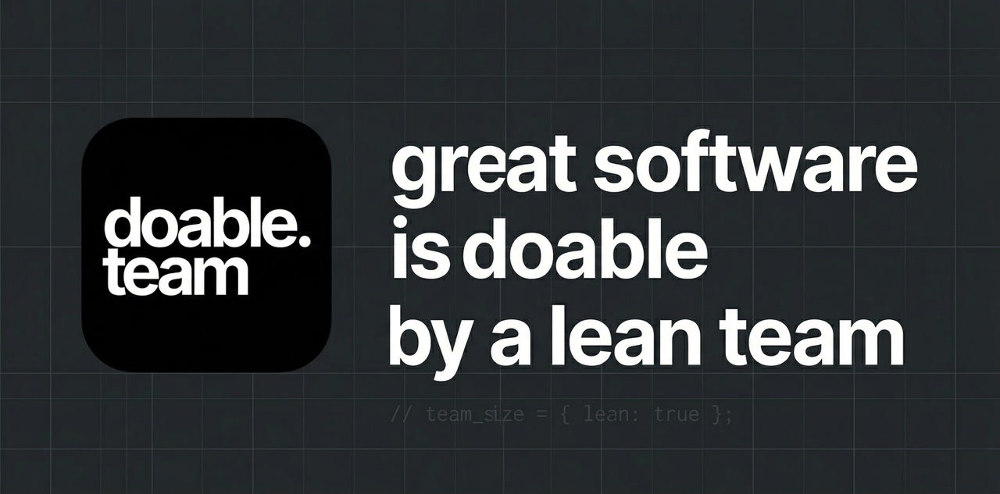
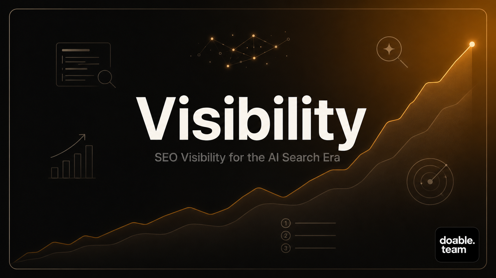
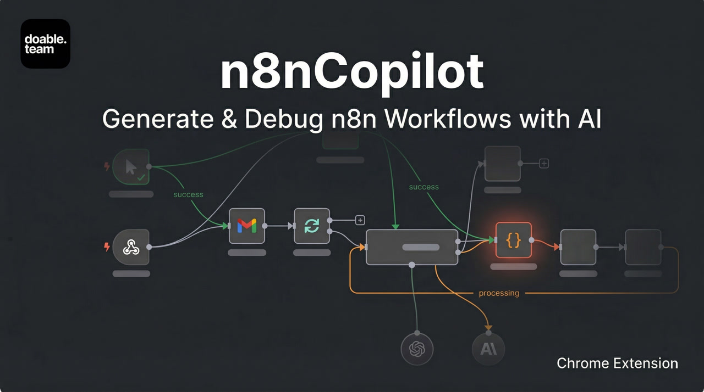
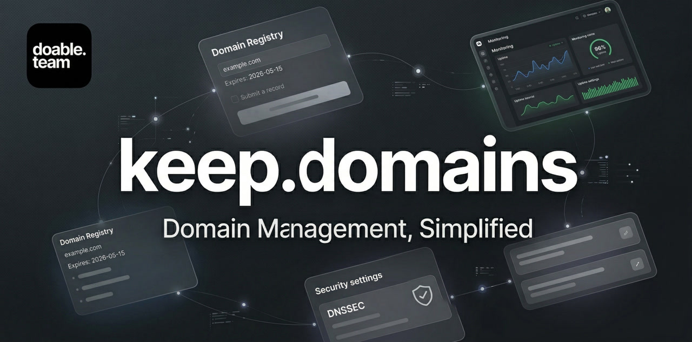
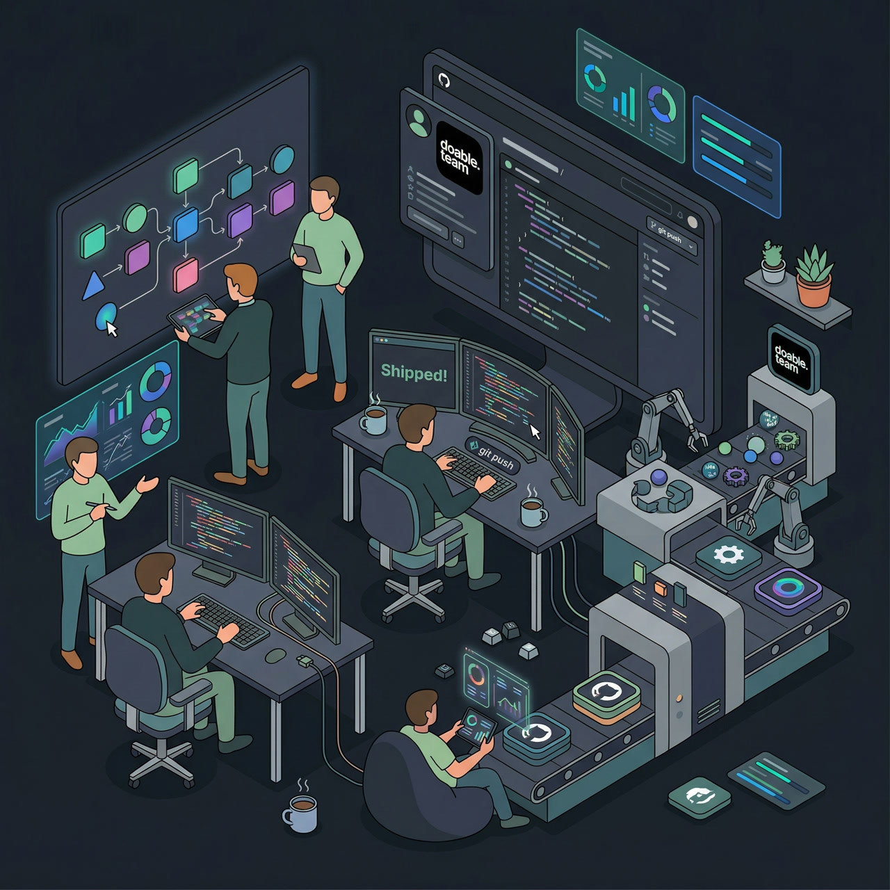

<p align="center">
  
</p>

<p align="center">
  <a href="https://doable.team">Website</a> &nbsp;&middot;&nbsp;
  <a href="mailto:hello@doable.team">Email</a> &nbsp;&middot;&nbsp;
  <a href="https://doable.team/career">Careers</a>
</p>

<p align="center">
  
  
  
</p>

---

We're a small software team building niche SaaS products. We focus on clear problems and simple solutions. We ship fast, listen to users, and improve over time.

No big promises. Just useful software that works.

---

### Our Products

<table>
  <tr>
    <td width="33%" align="center">
      <a href="https://visibility.so">
        
        <br />
        <strong>Visibility</strong>
      </a>
      <br />
      AI agents that run your SEO. Track your brand's visibility across ChatGPT, Gemini & Perplexity — and turn every insight into a shipped task.
      <br /><br />
      
    </td>
    <td width="33%" align="center">
      <a href="https://n8ncopilot.com">
        
        <br />
        <strong>n8nCopilot</strong>
      </a>
      <br />
      AI Chrome extension for generating & debugging n8n workflows in plain English. Open source & privacy-first.
      <br /><br />
      
      
    </td>
    <td width="33%" align="center">
      <a href="https://keep.domains">
        
        <br />
        <strong>keep.domains</strong>
      </a>
      <br />
      Modern domain management for investors. Auto-sync with Namecheap, Porkbun, Spaceship, GoDaddy & Cloudflare.
      <br /><br />
      
    </td>
  </tr>
</table>

---

### Our Manifest

```
01. Small ideas are worth shipping.
02. Simple tools beat complex systems.
03. We don't wait for perfect. We fix things as we go.
```

*Build. Learn. Improve. Repeat. That's doable.*

---

### Our Team

<p align="center">
  
</p>

<p align="center">
  We stay lean by choice. We value focus, ownership, and care over headcount.<br />
  Our team blends seasoned professionals with young, enthusiastic builders and marketers.
</p>

---

### Open Source

We believe in building in the open. Check out the engine behind n8nCopilot:

[](https://github.com/farhansrambiyan/n8n-Workflow-Builder-Ai)

---

<p align="center">
  <a href="https://doable.team"><strong>doable.team</strong></a> &nbsp;&middot;&nbsp;
  <a href="mailto:hello@doable.team">hello@doable.team</a>
</p>

<p align="center">
  <sub>Cleaner than 97% of web pages tested &middot; <a href="https://www.websitecarbon.com/website/doable-team/">Website Carbon Score</a></sub>
</p>
